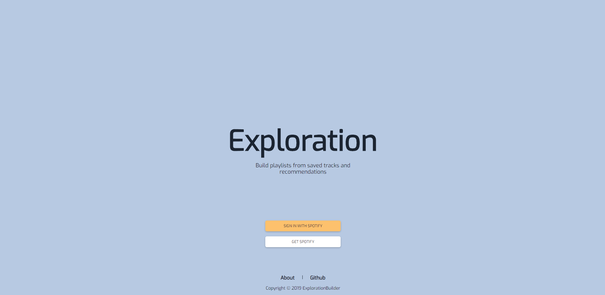
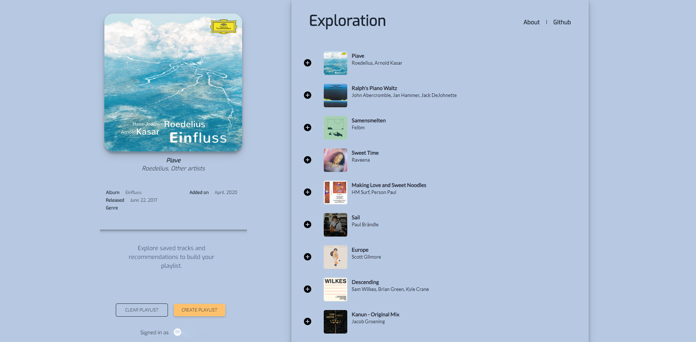
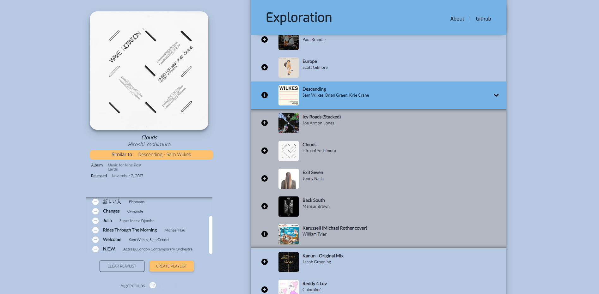

# Exploration (In development)
Build Spotify playlists from saved tracks and recommendations
###### Hosted at [Netlify](http://exploration-app.netlify.com/ "Netlify")  

This application was created as a sandbox for work in Angular and UI implementation. The application requires a Spotify login for use, and has access to the below scopes:
playlist-modify-private,  
playlist-read-private,  
user-read-private,  
user-read-email,  
user-library-read,  
[Spotify Authorization Scopes Documentation](https://developer.spotify.com/documentation/general/guides/scopes/ "Spotify Oath Scopes Documentation")

